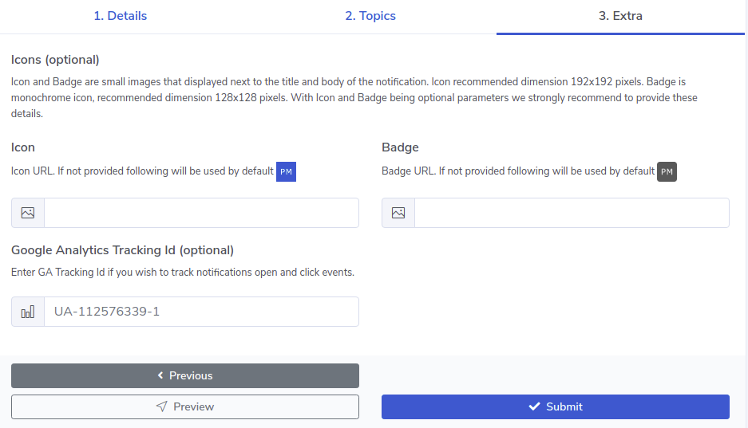
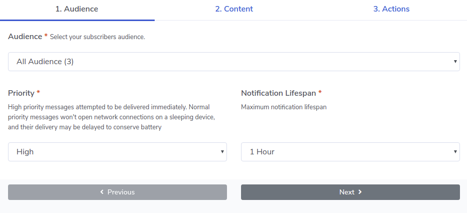

# [Pushmix](https://www.pushmix.co.uk) - web push notification service
Service allows to create and push customised web notification including 
* audience segmentation via topic subscription 
* customised opt in prompt
* real time user interaction in Google Analytics
* custom notification icon and badge
* action buttons with icons
* notification logs
* large image support


## Requirements
* write access to the website files
* website url must starts with `https://`

## Getting Started
This instructions will describe how to creating your first subscription opt in prompt, 
start build up your subscribers audience and push notifications.

First step is to create new account,simply login using Google or Facebook accounts [Pushmix - login](https://dash.pushmix.co.uk/login).
Alternatively create new account here - [Pushmix - register](https://dash.pushmix.co.uk/register). Only details that requiried is a name of your choice and email address.

### New Subscription

#### Creating subscription

In the dashboard you will be asked to create your first subscription, go for it.
Enter your website full URL, starting with `https://` where you wish to display your notification opt in.
Enter opt in title and optional line of text to provide subscribers with more details about this subscription.

You can edit subscription details and change all fields in exception of website address. If you have added website address wrong simply delete subscription and start again.

User can create more than one website subscription.


You can review opt in prompt by pressing `Preview` button, continue entering details and see changes in real time.


In the Topics tab you can specify up to two optional topics allowing users to receive targeted notifications.


On the third step you can specify notification icon, badge and Google Analytics tracking id, all these field are optional. Icon is the small image that displayed next to the tile and the body if the notification. Recommended icon image dimensions is 192x192 pixels. Badge is monochrome icon that used to provide more information to the user about where the notification sender. At the time of writing the badge is only used on Chrome for Android.

Some browsers the icon and badge images to be served over HTTPS.

Both of these fields are optional, however if the icon and badge values are not provided, default Pushmix icons will be used.

Track user interactions in real time with Google Analytics Event Tracking. Enter your GA Tracking Id to receive web notification views and action button click events.

 


#### Adding Subscription Code

**Service Worker**
After you have created subscription, first thing to do is to download `service worker` and upload it to the root of public directory on your web server.The `service worker` file must be accessible via public URL under the domain name you wish to push web notifications from.

For example `https://www.pushmix.co.uk/pm_service_worker.js`

If you wish to place service worker file inside of any other folders on your server, fill free to do so. However please don't forget to update service worker URL path in the tracking code, see bellow.

* What is the Service Worker ?

A Service Worker is a script that allows access to push notifications. Web Browser executes this script in the background, separate from the web page. Service workers only run over HTTPS, for security reasons.

See Google [search results](https://www.google.co.uk/search?safe=strict&ei=eC7GW_2iGszCgAaksp6QAQ&q=service+workers&oq=service+workes&gs_l=psy-ab.12...0.0..15074...0.0..0.0.0.......0......gws-wiz.NGcT7bDgRlo) for details and use of `service workers`.

* Do I have to use Service Worker?

Yes, Push Notifications are built on top of Service Worker API, which responds to push message events in the background and relays them to your application


**Subscription Code**

`Please do not use the subscription code bellow, this is only for illustration purposes.`

Copy subscription code from dashboard and paste it at the bottom of the web page to start building your audience. You can add subscription code to more than one page. When webpage is loaded subscription code trigger the opt in prompt to be displayed. In the event when web browser is not supported opt in prompt will not be shown.

You can easily change the behaviour and trigger opt in prompt to be displayed on the click event instead of the page load. 

```javascript
<script type="text/javascript">
    var _pm = {
        "subscriber_id": "UNIQUE_SUBSCRIPTION_ID",
        "sw" : "https://YOUR_DOMAIN_NAME/pm_service_worker.js",
        "api": "https://www.pushmix.co.uk/api/"
    };
    (function(){
        var block = document.createElement('script');
        block.type = 'text/javascript';
        block.async = false;
        block.defer = true;
        block.src = 'https://www.pushmix.co.uk/js/pm.js';
        var el = document.getElementsByTagName('script')[0];
        el.parentNode.insertBefore(block, el);
    })();  
</script> 
```


### Pushing Notification

Dashboard displays one or more of your subscriptions summary. Press `Push Notification` button at the bottom of subscription card.There are three steps that you will need to go through: Select Audience, Enter Content and Actions.

#### 1. Audience

**Audience**
At this you required select subscribers audience you would like to target, by default all subscribers are selected. In the brackets total number of subscribers are displayed. As per print screen bellow All Audience have 3 subscribers. 

During subscription creation process, if you have specified additional topics, they also be available for selection from dropdown box. Only one audience group can be selected at a time.

**Priority**
Next you have Priority dropdown that consists of two choices High and Normal, set to `High` by default. This feature regulate how push notification being delivered. 

High priority messages attempted to be delivered immediately. 

Normal priority messages won't open network connections on a sleeping device, and their delivery may be delayed to conserve battery.

**Notification Lifespan**

Maximum notification lifespan of a message correspond to the maximum period of time for which message delivery will be attempted, set to `1 Hour` by default. This feature helps to prevent you from delivering messages with outdated contain or content that no longer relevant. 

Consider subscriber device is turned off and you sending a message reminding about the event that happening at 6pm today. Subscriber switch on it's device on the following day to receive push notification that out of date no longer relevant.

