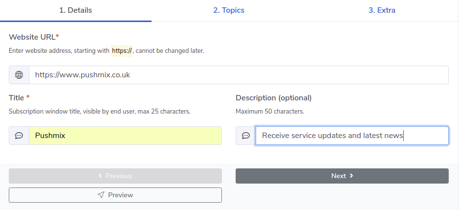
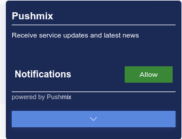
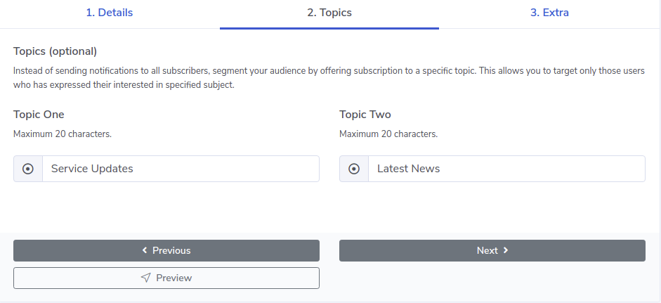
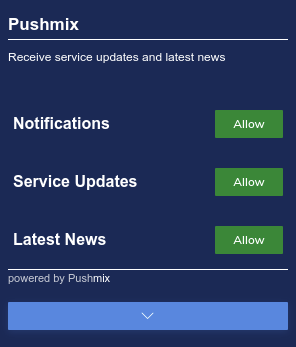

# [Pushmix](https://www.pushmix.co.uk) - web push notification service
Service allows to create and push customised web notification including 
* audience segmentation via topic subscription 
* customised opt in prompt
* real time user interaction in Google Analytics
* custom notification icon and badge
* action buttons with icons
* notification logs
* large image support

## Requirements
* write access to the website files
* website url must starts with `https://`

## Getting Started
This instructions will describe how to creating your first subscription opt in prompt, 
start build up your subscribers audience and push notifications.

First step is to create new account,simply login using Google or Facebook accounts [Pushmix - login](https://dash.pushmix.co.uk/login).
Alternatively create new account here - [Pushmix - register](https://dash.pushmix.co.uk/register). Only details that requiried is a name of your choice and email address.

### New Subscription
In the dashboard you will be asked to create your first subscription, go for it.
Enter your website full URL, starting with `https://` where you wish to display your notification opt in.
Enter opt in title and optional line of text to provide subscribers with more details about this subscription.

You can review opt in prompt by pressing `Preview` button, continue entering details and see changes in real time.

In the Topics tab you can specify up to two optional topics allowing users to receive targeted notifications.

